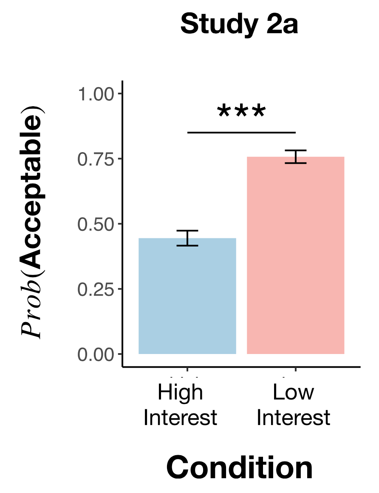

```{r setup, include=F}
require("knitr")
opts_knit$set(root.dir = "~/Documents/stanford/classes/psych251/levine2020/")
```

## Introduction

Levine et al. showed in their paper "The logic of universalization guides moral judgement" that people (both adults and children) sometimes make moral judgements by considering the hypothetical situation "what if everyone did that?" -- a process that they call *universalization*. They contrast a computational model of universalization with other models of moral judgement in a variety of experiments that capture a kind of collective action "threshold problem". In this report, I aim to replicate Study 2a in which they contrast universalizaion with rule-based, outcome-based, and pessimistic outcome models of moral judgement.

This study is relevant to my interests in social responsibility and the use of hypotheticals and counterfactuals in understanding and evaluating each other's actions. The original (preregistered) study was conducted via MTurk and all the stimuli are given in [supplemental materials](https://github.com/psych251/levine2020/blob/master/original_paper/levine2020_universalization_supplement.pdf), so I will be aiming to replicate it exactly. I will be trying to recreate the left half of Figure 4 from the paper (and possibly also Figure S5 from the supplemental), and running the same statistical analyses. The main challenge will be implementing the experiment and coding the analysis since I have only minimally worked with HTMl/JSPsych and R.

Links to [this repo](https://github.com/psych251/levine2020) and [the original paper](https://github.com/psych251/levine2020/blob/master/original_paper/levine2020_universalization.pdf).

## Methods

### Power Analysis

<!-- Original effect size, power analysis for samples to achieve 80%, 90%, 95% power to detect that effect size.  Considerations of feasibility for selecting planned sample size. -->
```{r include=F}
# power analysis of original data
library(pwr)
pwr.chisq.test(w = 0.32, N = 608, df = 4, sig.level = 0.05)

# sample size needed for 80% power, assumming original effect size
pwr.chisq.test(w = 0.32, df = 4, sig.level = 0.05, power = 0.8)

# extrapolating just one story and calculating effect size
# sem <- 0.08/2 * sqrt(608/5)
# d <- (0.66 - 0.44)/sem
# pwr.t.test(d = d, sig.level = 0.05, power = 0.8, alternative="greater")
```

### Planned Sample

Like the original study, participants will be recruited from MTurk. A smaller sample (n = 130) will be recruited due to financial constraints, but it will still be enough to report a result (if significant) based on the power analysis while accounting for possible exclusions.

### Materials and Procedure

Participants will be assigned to one of two conditions (High interest or Low interest) and one of five vignettes (catching fish, hunting birds, digging clams, foraging for mushrooms, or trapping rabbits) for which they will read a story about a collective action problem. Although the context of the vignettes differ, the basic structure is the same. For instance, the story about catching fish is as follows:

> Twenty vacationers currently fish in a sustainable way, but then a new fishing hook becomes available that allows each vacationer to catch many more fish. If fewer than three vacationers start using the hook, there will be no negative consequences; if more than seven vacationers start using the hook, then there is guaranteed to be a total collapse of the fish population by summer’s end. Thus, the harm threshold occurs at three to seven interested parties. The protagonist of this vignette, John, is interested in using the new hook. Participants are asked if doing so would be morally acceptable.

The exact text shown to participants is provided in the [supplemental materials](https://github.com/psych251/levine2020/blob/master/original_paper/levine2020_universalization_supplement.pdf) with the instructions on lines 97-100, comprehension questions (exclusion crteria) on lines 87-96, the stories themselves on lines 107-358, and experiment questions on lines 134-145. These will all be shown in the same order and same format as the original study.

### Analysis Plan

Data will be filtered using the same exclusion crteria as the original study: participants must correctly answer some comprehension questions in order to be included. After filtering the data, I will average participants' responses (morally acceptability ratings) across the five vignettes and within the two conditions. The ratings will be compared between the two conditions and visualized in a replication of the left half of Figure 4 from the paper. I will determine whether the difference is significant with the same statistical test as the original study:

>  Using a chi-squared analysis, we will see if subjects in the Low Interest condition are significantly more likely to say that the action is morally acceptable compared to subjects in the High Interest condition.

Lastly, like the original study, I will investigate whether participants' beliefs about rules or knowledge might explain their moral judgements instead. These were measured in the control questions.

For the "rule" question:

> There were only two subjects [out of 606 total] who answered that there was a rule on the lake forbidding the use of the hook. Judgments about the presence of a rule, therefore, do not explain subjects’ moral permissibility judgments.

For the "knowledge" question:

> We analyzed the knowledge question by looking at what proportion of subjects in each condition judged that no one would find out about John using the new hook (as opposed to thinking that 1 or more people would find out about it). There is a small but significant difference across the conditions ... (χ2(1) = 5.41, p = .020, two-tailed, V_Cramer = .09, CI95%[.01, .17], n = 608) ... we conducted a logistic regression to see if answers to the knowledge question could fully explain our finding (as we indicated we would do in the preregistration document), and, in fact, they could not. Once knowledge is added into the model along with condition, there is still a highly significant effect of condition.

So for these two questions, first a chi-squared analysis will be used to determine whether there is a significant difference in participants' answers by condition. If there is none, like for the rule question in the original study, then I can conclude that factor cannot explain people's moral acceptability judgements. If there *is* a significant difference, like for the knowledge question, then logistic regression with and without that factor can be conducted and compared to determine whether condition is still the main predictor of moral acceptability. If the same results are found in this replication as in the original study, then I should be able to recreate Figure S5 from the supplemental.

### Differences from Original Study

The recruiting process, materials, and experimental procedure used in this replication report will be the same as those in the original study.
<!-- The only difference is that it will effectively be a replication at a smaller scale: less participants will be recruited and only one of five stories will be used. However, given that (1) the authors of the original study still found a significant result within each story, (2) their full model found no effect of which story was used, and (3) their combined results were very significant (p<0.001), I don't anticipate that this difference will make a large impact based on the claims in the original paper. -->

### Methods Addendum (Post Data Collection)

You can comment this section out prior to final report with data collection.

#### Actual Sample
  Sample size, demographics, data exclusions based on rules spelled out in analysis plan

#### Differences from pre-data collection methods plan
  Any differences from what was described as the original plan, or “none”.


## Results


### Data preparation

Data preparation following the analysis plan.
	
```{r include=T, message=F}
### Prepare Data

#### Load Relevant Libraries and Functions
library(tidyverse)
library(ggstatsplot)   # extension of ggplot2
library(rcompanion)    # for cramer's V

# set default plot theme 
theme_set(theme_classic() + 
          theme(text = element_text(size = 20))) 

# suppress warnings about grouping 
options(dplyr.summarise.inform = F)

### Import Data
data <- read_csv("experiment/pilotB-trials.csv")
head(data)

#### Filter Data
data_filtered <- data %>%
  # Q1: include if answer is 19 && condition is high, or if answer is 0 && condition is low
  filter((exclude1 == '19' & condition == 'high') | (exclude1 == '0' & condition == 'low')) %>%
  # Q2: include if answer is 19, 20, or 21
  filter(exclude2 %in% c('19', '20', '21')) %>%
  # Q3: include if answer is 0
  filter(exclude3 == '0') %>%
  # Q4: include if answer is C (multiple choice A, B, or C)
  filter(grepl('It will not make a difference to the fish population.', exclude4))

#### Prepare data for analysis - create columns etc.
data_filtered <- data_filtered %>%
  # add dummy rows in case no data for either condition
  add_row(condition = 'high') %>%
  add_row(condition = 'low') %>%
  mutate(acceptability01 = ifelse(acceptability == 'Yes', 1, 0))

data_toplot <- data_filtered %>%
  group_by(condition) %>%
  # use 0 if no data for either condition, otherwise use true mean and sd
  summarise(m_raw = mean(acceptability01, na.rm = TRUE),
            m = ifelse(is.nan(m_raw), 0, m_raw),
            sd_raw = sd(acceptability01, na.rm = TRUE),
            sd = ifelse(is.na(sd_raw), 0, sd_raw),
            n = n(),
            se = sd/sqrt(n()),
            upper = m + se*1.96,
            lower = m - se*1.96)  %>%
  subset(select = -c(m_raw, sd_raw))
```

### Confirmatory analysis

#### Figures
- Recreation of Figure 4 from the paper

{width=49%}
```{r, echo=F, fig.width=4, fig.height=5, out.width='49%'}
ggplot(data_toplot, aes(x = condition, y = m)) +
  geom_col(aes(fill = condition)) +
  geom_errorbar(aes(ymin = lower, ymax = pmin(upper, 1)),
                  width = 0.2) +
  ylim(0, 1) +
  theme(aspect.ratio = 1.1,
        legend.position = 'none',
        text = element_text(size = 22),
        plot.title = element_text(size = 22,
                                  face = 'bold',
                                  hjust = 0.5),
        axis.title.x = element_text(face = 'bold'),
        axis.title.y = element_text(face = 'bold')) +
  ggtitle('Pilot B (n = 2)') +
  scale_x_discrete(labels=c('high' = 'High \n Interest',
                            'low' = 'Low \n Interest')) +
  xlab('Condition') +
  ylab('Prob(Acceptable)') +
  scale_fill_brewer(palette = 'Pastel2')
```

#### Statistical tests
- Results of chi-squared analysis

```{r include=T, warning=F}
data_wide <- data_filtered %>%
  # group_by(context) %>%
  # add imaginary data for now
  add_row(condition = 'low', acceptability = 'Yes') %>%
  add_row(condition = 'high', acceptability = 'Yes') %>%
  add_row(condition = 'high', acceptability = 'No') %>%
  subset(select = c(condition, acceptability))

# create contingency table (frequency)
t <- table(data_wide$condition, data_wide$acceptability)

chisq.test(t)

cramerV(t)
```

#### Other factors
- (If necessary:) Results of analysis on rule and knowledge questions, and side-by-side comparison of Figure S5 from supplemental

```{r}
data_filtered
```

Both pilot subjects answered 'No' for the rule question and '0' for the knowledge question, indicating that their moral judgements were not based on assumptions about the presence of rules or other agents' knowledge of John's actions.

## Discussion

### Summary of Replication Attempt

Open the discussion section with a paragraph summarizing the primary result from the confirmatory analysis and the assessment of whether it replicated, partially replicated, or failed to replicate the original result.  

### Commentary

Add open-ended commentary (if any) reflecting (a) insights from follow-up exploratory analysis, (b) assessment of the meaning of the replication (or not) - e.g., for a failure to replicate, are the differences between original and present study ones that definitely, plausibly, or are unlikely to have been moderators of the result, and (c) discussion of any objections or challenges raised by the current and original authors about the replication attempt.  None of these need to be long.
