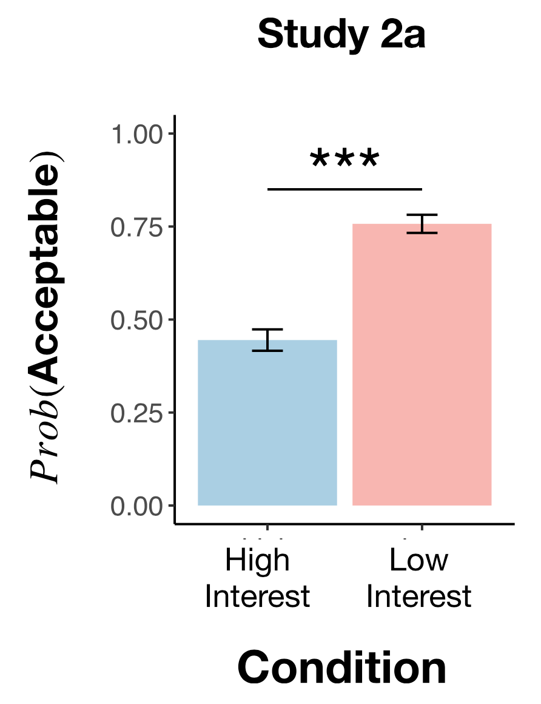

```{r setup, include=F}
require("knitr")
opts_knit$set(root.dir = "~/Documents/stanford/classes/psych251/levine2020/")

# load relevant libraries and functions
library(pwr)
library(tidyverse)
library(ggstatsplot)   # extension of ggplot2
library(rcompanion)    # for cramer's V

# set default plot theme 
theme_set(theme_classic() + 
          theme(text = element_text(size = 20))) 

# suppress warnings about grouping 
options(dplyr.summarise.inform = F)
```

## Introduction

Levine et al. showed in their paper "The logic of universalization guides moral judgement" that people (both adults and children) sometimes make moral judgements by considering the hypothetical situation "what if everyone did that?" -- a process they call *universalization*. To the extent that it would be bad if everyone took a certain action, people may conclude that that action would be morally unacceptable. Levine et al. contrast a computational model of universalization with other models of moral judgement through several experiments that capture a kind of moral scenario called a *collective action* problem. In this report, I aim to replicate Study 2a, which tests a particular computational feature of universalization (sensitivity to interest).

This study is relevant to my interests in social responsibility and the use of hypotheticals and counterfactuals in evaluating each other's actions. The original study was pregistered and conducted via MTurk. All the prompts are given in the [supplemental materials](https://github.com/psych251/levine2020/blob/master/original_paper/levine2020_universalization_supplement.pdf), so I am hoping to replicate it exactly. I will be recreating the left half of Figure 4 from the paper and running the same statistical tests. The main challenge will be implementing the experiment and coding the analysis since I haven't worked very much with HTML/JSPSych or R.

Links to [this repo](https://github.com/psych251/levine2020) and [the original paper](https://github.com/psych251/levine2020/blob/master/original_paper/levine2020_universalization.pdf).

## Methods

### Power analysis

Power analysis of original data:
```{r include=T}
pwr.chisq.test(w = 0.32, N = 608, df = 1, sig.level = 0.05)
```


### Planned sample

Sample size needed for 80% power, assumming original effect size:
```{r}
pwr.chisq.test(w = 0.32, df = 1, sig.level = 0.05, power = 0.8)
```

Like the original study, participants will be recruited from MTurk. A smaller sample (n = 140) will be recruited for budget reasons, but it should still be enough to report a result (if significant) based on the power analysis, while accounting for possible exclusions.

### Materials and procedure

Participants will be assigned to one of two conditions (high interest or low interest) and one of five contexts (catching fish, hunting birds, digging clams, foraging for mushrooms, or trapping rabbits). They will read a story about some kind of environmental collective action problem that differs by context, but has the same overall structure. For instance, the story about catching fish goes something like:

> Twenty vacationers currently fish in a sustainable way, but then a new fishing hook becomes available that allows each vacationer to catch many more fish. If fewer than three vacationers start using the hook, there will be no negative consequences; if more than seven vacationers start using the hook, then there is guaranteed to be a total collapse of the fish population by summer’s end. Thus, the harm threshold occurs at three to seven interested parties. The protagonist of this vignette, John, is interested in using the new hook. Participants are asked if doing so would be morally acceptable.

The exact text shown to participants is provided in the [supplemental materials](https://github.com/psych251/levine2020/blob/master/original_paper/levine2020_universalization_supplement.pdf) with the instructions on lines 97-100, comprehension questions (exclusion crteria) on lines 87-96, the stories themselves on lines 107-358, and experiment questions on lines 134-145. These will all be shown in the same order and same format as the original study.

### Analysis plan

Data will be filtered using the same exclusion criteria as the original study: participants must correctly answer some comprehension questions in order to be included. After filtering the data, I will average participants' responses (morally acceptability ratings) across the five contexts and within the two conditions. I will compare the ratings with those found in the original study both qualitatively (figures) and quantatively (statistical tests).

>  Using a chi-squared analysis, we will see if subjects in the Low Interest condition are significantly more likely to say that the action is morally acceptable compared to subjects in the High Interest condition.

Lastly, like the original study, I will investigate whether participants' beliefs about rules or knowledge might explain their moral judgements instead. These were measured in the control questions.

For the "rule" question:

> There were only two subjects [out of 606 total] who answered that there was a rule on the lake forbidding the use of the hook. Judgments about the presence of a rule, therefore, do not explain subjects’ moral permissibility judgments.

For the "knowledge" question:

> We analyzed the knowledge question by looking at what proportion of subjects in each condition judged that no one would find out about John using the new hook (as opposed to thinking that 1 or more people would find out about it). There is a small but significant difference across the conditions ... (χ2(1) = 5.41, p = .020, two-tailed, V_Cramer = .09, CI95%[.01, .17], n = 608) ... we conducted a logistic regression to see if answers to the knowledge question could fully explain our finding (as we indicated we would do in the preregistration document), and, in fact, they could not. Once knowledge is added into the model along with condition, there is still a highly significant effect of condition.

So for these two questions, first I will run a chi-squared analysis to determine whether there is a significant difference in participants' answers by condition. If there is none, like for the rule question in the original study, then I can conclude that factor cannot explain people's moral acceptability judgements. If there *is* a significant difference, like for the knowledge question, then logistic regression with and without that factor can be conducted and compared to determine whether condition is still the main predictor of moral acceptability. If the same results are found in this replication as in the original study, then I should be able to recreate Figure S5 from the supplemental.

### Differences from original study

None.

### Methods addendum (post-data collection)

#### Actual sample

The sample size was n = 140 (14 participants in each of the 10 conditions). Only n = 51 participants were kept in the analysis after filtering based on control questions, giving an exclusion rate of 64.5%. This was much higher than the exclusion rate of 39.4% from the original study. No demographic information was collected.

#### Differences from pre-data collection methods plan

None.


## Results


### Data preparation

Importing the data:
```{r include=T, message=F}
story1_low <- read_csv('data/story1_low-trials.csv')
story1_high <- read_csv('data/story1_high-trials.csv')
data <- rbind(story1_low, story1_high)
for (i in 2:5) {
  for (cond in c('high', 'low')) {
    d <- read_csv(paste('data/story', i, '_', cond, '-trials.csv', sep=''))
    data <- rbind(data, d)
  }
}
```

Filtering the data:
```{r include=T, message=F}
data_filtered <- data %>%
  # Q1: include if answer is (19 or 20) && condition is high
  #     or if answer is 0 && condition is low
  # *this is modified from original study* see Discussion
  filter((exclude1 %in% c('19', '20') & condition == 'high') | (exclude1 == '0' & condition == 'low')) %>%
  # Q2: include if answer is 19, 20, or 21
  filter(exclude2 %in% c('19', '20', '21')) %>%
  # Q3: include if answer is 0
  filter(exclude3 == '0') %>%
  # Q4: include if answer is C (multiple choice A, B, or C)
  filter(startsWith(exclude4, 'It will not make a difference'))
```

Preparing the data for analysis - creating columns etc.:
```{r include=T, message=F}
data_filtered <- data_filtered %>%
  # add dummy rows in case no data for either condition
  #add_row(condition = 'high') %>%
  #add_row(condition = 'low') %>%
  mutate(acceptability01 = ifelse(acceptability == 'Yes', 1, 0))

data_toplot <- data_filtered %>%
  group_by(condition) %>%
  # use 0 if no data for either condition, otherwise use true mean and sd
  summarise(m_raw = mean(acceptability01, na.rm = TRUE),
            m = ifelse(is.nan(m_raw), 0, m_raw),
            sd_raw = sd(acceptability01, na.rm = TRUE),
            sd = ifelse(is.na(sd_raw), 0, sd_raw),
            n = n(),
            se = sd/sqrt(n()),
            upper = m + se*1.96,
            lower = m - se*1.96)  %>%
  subset(select = -c(m_raw, sd_raw))
```

A slightly different exclusion criteria was used for Q1. The original criteria was:

> To be included in the study, participants must report 19 in the high interest condition and 0 in the low interest condition.

However, I think this might have been a typo, and I let participants in the replication report either 19 or 20 here.

### Confirmatory analysis

#### Figures

Code for plotting:
```{r eval=F, echo=T}
ggplot(data_toplot, aes(x = condition, y = m)) +
  geom_col(aes(fill = condition)) +
  geom_errorbar(aes(ymin = lower, ymax = pmin(upper, 1)),
                  width = 0.2) +
  ylim(0, 1) +
  theme(aspect.ratio = 1.1,
        legend.position = 'none',
        text = element_text(size = 22),
        plot.title = element_text(size = 22,
                                  face = 'bold',
                                  hjust = 0.5),
        axis.title.x = element_text(face = 'bold'),
        axis.title.y = element_text(face = 'bold')) +
  ggtitle('Replication') +
  scale_x_discrete(labels=c('high' = 'High \n Interest',
                            'low' = 'Low \n Interest')) +
  xlab('Condition') +
  ylab('Prob(Acceptable)') +
  scale_fill_manual(values=c("#6699CC", "#EE8888"))
```

The original study (Figure 4 from the paper) shown on the left and this replication shown on the right:

{width=51%}
```{r echo=F, fig.width=4, fig.height=5, out.width='47%'}
ggplot(data_toplot, aes(x = condition, y = m)) +
  geom_col(aes(fill = condition)) +
  geom_errorbar(aes(ymin = lower, ymax = pmin(upper, 1)),
                  width = 0.2) +
  ylim(0, 1) +
  theme(aspect.ratio = 1.1,
        legend.position = 'none',
        text = element_text(size = 22),
        plot.title = element_text(size = 22,
                                  face = 'bold',
                                  hjust = 0.5),
        axis.title.x = element_text(face = 'bold'),
        axis.title.y = element_text(face = 'bold')) +
  ggtitle('Replication') +
  scale_x_discrete(labels=c('high' = 'High \n Interest',
                            'low' = 'Low \n Interest')) +
  xlab('Condition') +
  ylab('Prob(Acceptable)') +
  scale_fill_manual(values=c("#6699CC", "#EE8888"))
```

```{r echo=F}
ggsave('writeup/results_replication.png', width=4, height=5, antialias='none')
```

#### Statistical tests
Chi-squared analysis:

```{r include=T, warning=F}
# create contingency table (frequency)
t <- table(data_filtered$condition, data_filtered$acceptability)
chisq.test(t)
cramerV(t)
pwr.chisq.test(w = 0.1786, N = 51, df = 1, sig.level = 0.05)
```

#### Other factors

Number of participants who thought there was some sort of rule in place:
```{r}
sum(data_filtered$rule == 'Yes')
```
Only 1 (out of 51) participants answered 'Yes' to the rule control question, indicating that assumptions about the presence of a rule do not explain overall moral acceptability judgements.

Number of participants (out of 51) who thought others would know about John's decision:
```{R}
sum(data_filtered$know != 0)
data_know <- mutate(data_filtered, know01 = (know == 0))
t_know <- table(data_know$condition, data_know$know01)
chisq.test(t_know)
```
11 (out of 51) participants believed that at least one other person would know about John's use of the new tool (depending on context). However, as shown by a chi-square analysis on judgements of knowledge by participants in each condition, there was no significant difference across the conditions (p = 1). Thus, assumptions about knowledge of John's decision do not explain overall moral acceptability judgements either.


## Discussion

### Summary of replication attempt

The original study reported a significant difference in moral acceptability ratings between the two conditions:

> low interest: 76%, high interest: 44%, p < 0.001, Vcramer = 0.32 

I was unable to replicate the significance of this difference and found a smaller effect size (low interest: 74%, high interest: 56%, p = 0.326, Vcramer = 0.179). But, this replication was underpowered (power = 0.247). The figures suggest that the effect is there and in the same direction with roughly similar means -- the only difference is that the error bars of the replication are much larger -- so I think the main failure mode is the lack of power. If I had recruited a larger sample and/or a higher quality sample where less participants could be excluded, then it's possible I would have been able to fully replicate the original study.

### Commentary

#### Assessment of replication
Given that there were no methodological differences between the original study and this replication, I think the main reason for the failure to replicate is the lack of statistical power. This was due to finding a smaller effect size and excluding more subjects than expected (I'm not entirely sure why -- maybe just random variance on MTurk). Qualitatively, the figures suggest the effect is there and likely to be replicable with high enough power / a large enough sample.

#### Objections and challenges

In the original analysis following the authors' descriptions exactly, all 70 subjects in the high interest condition were excluded. After carefully going through every single participants' responses and through the materials again, I found what I think might have been an error on the authors' part. I don't think the answers to their exclusion criteria (comprehension checks) are clear from their materials. For instance, the story in the fishing context says:

> There are 20 people who regularly fish in Lake Wilson during the summer...John manages to talk to all 20 people who regularly fish in the lake.

Two of the comprehension checks were:

> Q1: How many people, besides John, would like to use the new hooks if there were no bad effects of doing so? To be included in the study, participants must report 19 in the high interest condition [in which everyone John talks to says that they would like to use the new hook if there were no bad effects].

> Q2: How many people regularly fish in Lake Wilson in the summer? To be included, subjects must answer 19, 20, or 21.

Based on the story, I think it's unclear whether the answer to Q1 is 19 or 20 and whether the answer to Q2 is 20 or 21 -- is John one of the regular fisherpeople or not? So, it's reasonable that participants gave a range of answers to these two questions, but I find it odd that the authors would allow three possible answers for Q2 but only one possible answer for Q1, given that the source of ambiguity is the same. In this replication, it happened that no one in the high interest condition answered 19 for Q1. However, some participants answered 20 for Q1, so I decided to modify the exclusion criteria to account for that. This was my best guess of the authors' intentions and the best solution for me to carry on with the confirmatory analysis. It's plausible that the authors didn't make any typos and that all the participants in the high interest conditions in the replication should have indeed been excluded. In any case, this was a pretty unexpected, confusing, and time-consuming challenge that came up, and I think such issues can always be easily prevented by developing *sound* materials (especially vignettes) that have *clear* corresponding exclusion criteria. 

